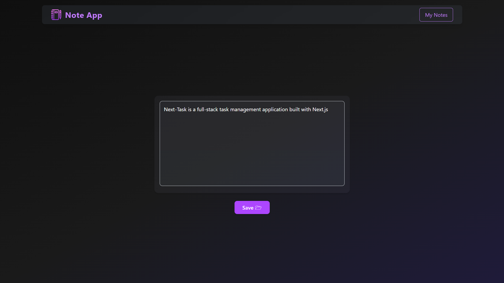
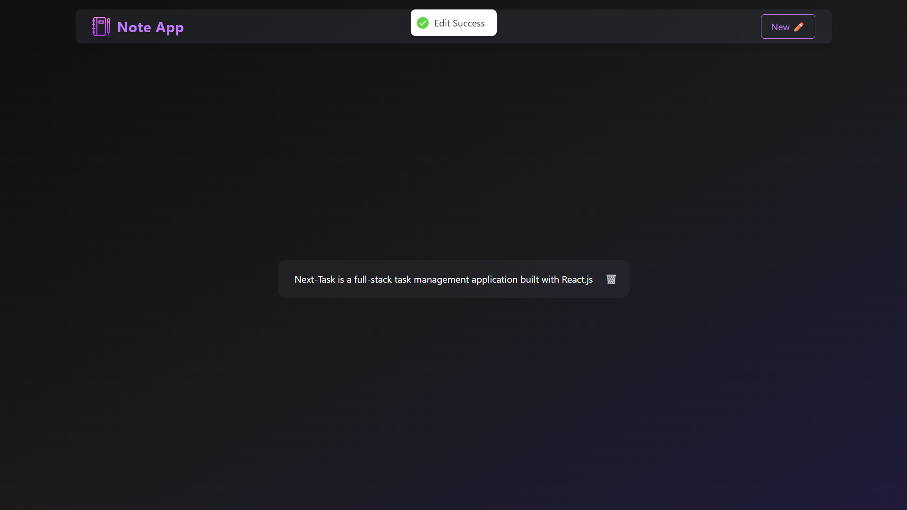

# Full-Stack Note-Taking Web App

A modern, full-stack note-taking application built with Next.js, MongoDB, JWT authentication, Nodemailer, and Tailwind CSS.

## Description

This project empowers users to securely register, log in, and manage personal notes. Key features include:

- **Secure authentication** with JWT.
- **Email capabilities** using Nodemailer (e.g., for verification and notifications).
- **CRUD operations** for note-taking.
- **Responsive, modern UI** powered by Tailwind CSS.
- **Scalable data management** using MongoDB.

Built to streamline personal note organization with security and style at its core.

## Demo

## Features

- User registration, login & logout with secure JWT handling
- Email functionality (verification, OTP) via Nodemailer
- Create, read, update, and delete notes
- Mobile-first user interface built with Tailwind CSS
- Persistent data storage using MongoDB and Mongoose

## Tech Stack

| Component    | Technologies Used                        |
|--------------|-------------------------------------------|
| Frontend     | Next.js, Tailwind CSS              |
| Backend      | Next.js API routes, JWT, Nodemailer       |
| Database     | MongoDB with Mongoose                      |

---
## Live

🔗 [Visit](https://note-pvt.vercel.app)
